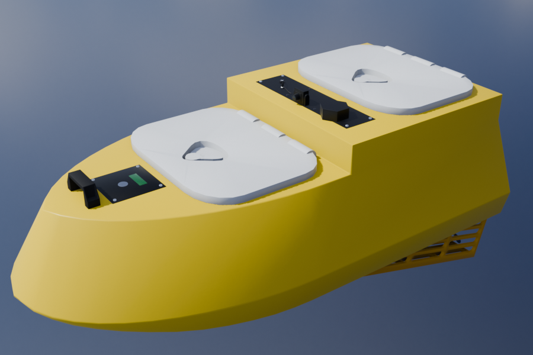

# ASV Simulation Platform — Unreal Engine

Visual hardware-in-the-loop environment for an autonomous surface vessel. The
project combines Unreal Engine ocean rendering, deterministic scene generation,
camera emulation and a lightweight TCP interface for an external Jetson runtime.

This directory is intentionally simulation-only. It contains no VLA runtime,
training code, model weights, datasets, acceptance logs or low-level controller
implementation.

## Contents

- `Content/`: Unreal maps, Blueprints, materials, vessel assets and environments.
- `Source/HILSimulation/`: deterministic scene automation, camera projection and image compression.
- `Plugins/ObjectDeliverer/`: TCP transport used by the Jetson bridge.
- `Config/`: engine, project and input configuration.
- `tools/`: project-owned asset import and maintenance utilities.
- `docs/assets/`: screenshots used by this README.

## Run

Open `HILPlatform.uproject` with Unreal Engine 5.8, build the `HILPlatformEditor`
target when prompted, and launch the configured simulation map from the editor.

The runtime exposes two TCP channels:

- Port `8080`, Unreal to Jetson: compressed camera frames and ASV/entity state.
- Port `8081`, Jetson to Unreal: body-frame desired displacement and stop commands.

The ROS 2 boundary deliberately lives on Jetson. The `bridge` package in the
Jetson workspace translates between these TCP messages and the existing ROS 2
topics, so Unreal does not require a native ROS plugin.

## Simulation and assets

`USceneAutomationSubsystem` creates reproducible layouts from a seed and applies
lightweight domain randomization. `UImageCompressionLibrary` converts a
SceneCapture render target into the compressed camera stream used by the
external autonomy stack.

Blender is used to author vessel and scene geometry. USD is the interchange
format for inspecting assets in Omniverse and updating matching Unreal static
meshes through the project tools; Blender is part of the asset pipeline rather
than a separate simulation backend.

  
  

## Requirements and portability

- Windows 11 and Unreal Engine 5.8.
- ObjectDeliverer, Water, Landmass, HDRI Backdrop and the project-enabled USD plugins.
- Blender and Omniverse are optional authoring tools; they are not runtime dependencies.

All project-owned runtime assets are stored under this directory. Unreal Engine,
Marketplace plugins and optional authoring applications remain external installations.
